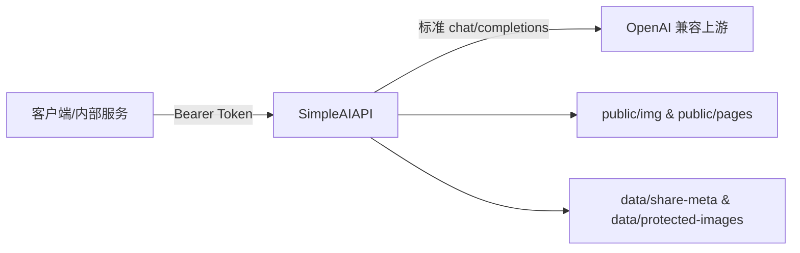

# SimpleAIAPI

> 🚀 基于 Express + TypeScript 的极简 OpenAI 兼容中转层，专注于“鉴权 + 消息标准化 + 富媒体渲染 + 分享页面”一条龙体验。

## 目录

1. [项目简介](#项目简介)
2. [架构概览](#架构概览)
3. [目录结构](#目录结构)
4. [快速开始](#快速开始)
5. [环境变量说明](#环境变量说明)
6. [API 使用说明](#api-使用说明)
7. [静态资源与分享页面](#静态资源与分享页面)
8. [日志与运维](#日志与运维)
9. [常见问题](#常见问题)

## 项目简介

SimpleAIAPI 让内部系统可以复用现有的 OpenAI 风格接口，而调用方只需提供一个 **`model/system/数字键`** 的扁平 JSON。项目同时支持文本、多张图片、LaTeX 渲染、托管页面分享与自动清理图片，是自建模型网关或多团队共用 API Key 的轻量化方案。

### 核心特性

- 🛡️ **入口鉴权**：验证标准 `Authorization: Bearer xxx` 请求头，可配置多枚入口 Token。
- 🔁 **多上游轮询**：`UPSTREAM_API_KEYS` 支持多 Key 轮询，减少单 Key 额度耗尽带来的中断。
- 📨 **消息扁平化**：自动把 `system` + 数字键消息转换成 OpenAI `chat/completions` 标准格式。
- 🖼️ **富媒体支持**：支持外链图片、Base64 图片写入 `/public/img`，并在转发时生成绝对地址。
- 🧮 **Markdown + LaTeX 渲染**：内置 markdown-it + KaTeX，可输出纯文本、HTML 片段或托管页面。
- 🔗 **一键分享**：`render=page` 自动生成分享页面、分享链接与提问记录，方便产品/运营查看。
- 🧹 **图片生命周期管理**：定期巡检 `public/img`，配合白名单避免分享中的图片被误删。
- 🧾 **彩色 Emoji 日志**：自定义 Logger 输出，关键步骤全链路可追踪。

## 架构概览



1. 客户端 POST `/` 或 `/proxy`，附带授权头与扁平化消息。
2. 中转层解析请求、拉取/生成静态资源、调用上游模型。
3. 根据 `render` 选项返回纯文本、HTML 或托管页面链接，相关图片落地到 `public/img`。
4. 后台定期清理过期图片，保证磁盘可控。

## 目录结构

```
.
├── src
│   ├── middleware        # request logger、鉴权中间件
│   ├── services          # payload 解析、消息构建、上游调用、渲染、分享等核心逻辑
│   ├── utils             # 静态资源、URL、Katex、元数据、保护列表等工具
│   └── server.ts         # Express 入口
├── public
│   ├── img               # Base64 图片写入目录（挂载卷）
│   └── pages             # 生成的分享页面、字体等静态资源
├── data
│   ├── share-meta        # 分享页面元数据
│   └── protected-images.json
├── docker-compose.yml
├── .env.example
└── README.md
```

## 快速开始

### 环境依赖

- Node.js 18+（推荐 20 LTS）
- npm 10+
- Docker & Docker Compose（可选，用于一键部署）

### 本地运行

```bash
git clone <repo-url>
cd SimpleAIAPI
cp .env.example .env           # 根据需求调整配置
npm install
npm run dev                   # 热重载开发模式

# 构建并运行生产版本
npm run build
npm start
```

### Docker Compose

```bash
cp .env.example .env
docker compose up --build -d
```

`docker-compose.yml` 默认把 `./public/img` 以卷形式挂载，便于持久化分享图片。

## 环境变量说明

| 变量 | 默认值 | 说明 |
| --- | --- | --- |
| `PORT` | `8080` | HTTP 服务监听端口 |
| `AUTH_TOKENS` | `-` | 入口鉴权 Token，逗号分隔，必填 |
| `UPSTREAM_BASE_URL` | `https://api.openai.com/v1` | 兼容 OpenAI 的上游地址 |
| `UPSTREAM_API_KEYS` | `-` | 上游 API Key 列表，至少一枚，支持轮询 |
| `DEFAULT_MODEL` | `gpt-4o-mini` | 未指定 `model` 时的默认模型 |
| `TEMPERATURE` `MAX_TOKENS` `TOP_P` `FREQUENCY_PENALTY` `PRESENCE_PENALTY` | `undefined` | 全局默认参数，可选填 |
| `PUBLIC_BASE_URL` | 来自请求的 host | 对外拼接静态资源/分享链接时使用的根地址 |
| `REQUEST_TIMEOUT_MS` | `60000` | 上游接口超时时间 |
| `IMAGE_RETENTION_DAYS` | `7` | Base64 图片保留天数，设为 `0` 可关闭自动清理 |
| `IMAGE_CLEANUP_INTERVAL_MINUTES` | `60` | 清理任务的巡检频率（分钟） |
| `LOG_ASSISTANT_RESPONSES` | `false` | 设为 `true` 时日志会额外输出模型完整回答（注意脱敏） |
| `SANITIZE_HTML` | `true` | 控制 Markdown 渲染后是否做 HTML 清洗 |
| `TZ` | 系统默认 | 容器/进程时区，可在 Docker 中透传为 `Asia/Shanghai` |

> ✅ 建议复制 `.env.example` 后调整，避免遗漏必要字段。

## API 使用说明

### 端点列表

| 方法 | 路径 | 说明 | 认证 |
| --- | --- | --- | --- |
| `POST` | `/` | 核心转发接口 | 需要 `Authorization: Bearer <token>` |
| `POST` | `/proxy` | 功能同 `/`，便于兼容旧路径 | 同上 |
| `GET` | `/health` | 存活检查，返回 `status + timestamp` | 不需要 |
| `GET` | `/share/:shareId` | 读取托管页面 | 不需要（链接即权限） |

服务还会暴露静态目录：`/img/xxx`（图片）、`/pages/...`（HTML/字体）。

### 请求体示例

```json
{
  "model": "gpt-4o-mini",
  "system": "你是资深旅游顾问",
  "0": "请帮我规划 3 天北京行程，包含亲子活动",
  "1": "https://example.com/forbidden-city.jpg",
  "2": "data:image/png;base64,iVBORw0KGgoAAAANSUhEUgAA...",
  "render": "page"
}
```

- `system`：可选的系统提示词。
- 数字键：按顺序代表用户消息，可是文本、图片 URL，也可传 Base64。
- 图片处理：Base64 自动写入 `public/img/<nanoid>.xxx`，外链会原样保留。
- `render` 取值：
  - 未传或 `false`：返回纯文本（`text/plain`）。
  - `true` / `"html"` / `"inline"`：返回渲染后的 HTML 片段（`text/html`），包含 Markdown + KaTeX。
  - `"page"` / `"hosted"` / `"url"`：生成托管页面，API 返回可直接分享的 URL。

### 响应格式

| 渲染模式 | Content-Type | 响应内容 |
| --- | --- | --- |
| 纯文本 | `text/plain; charset=utf-8` | 模型原始回答（已合并 assistant 内容） |
| HTML 片段 | `text/html; charset=utf-8` | 加入 KaTeX 样式后的 HTML 字符串 |
| 托管页面 | `text/plain; charset=utf-8` | 预览页面 URL；分享链接可在页面中复制 |
| 错误 | `application/json` | `{ "error": "message" }` |

若开启 `LOG_ASSISTANT_RESPONSES=true`，日志会额外输出完整回答，便于排障。

## 静态资源与分享页面

- **Base64 图片写入**：位于 `public/img`，可通过 `PUBLIC_BASE_URL/img/<文件名>` 直接访问。
- **分享页面**：`render=page` 会生成两份 HTML：
  - 预览页（仅含回答）用于 API 返回的 URL。
  - 分享页（含提问记录）位于 `/share/:shareId`，会把图片标记为“保护状态”，避免被周期清理。
- **元数据持久化**：`data/share-meta/<shareId>.json` 保存页面与图片映射，`protected-images.json` 记录不应被清理的文件名。
- **自动清理**：`IMAGE_RETENTION_DAYS > 0` 时启动定时任务，按照 `IMAGE_CLEANUP_INTERVAL_MINUTES` 巡检；可通过将保留天数设为 `0` 来彻底关闭，并自行管理磁盘。

## 日志与运维

- 日志级别：`info / warn / error / http / debug`，均带 Emoji + ISO 时间戳，便于快速定位。
- 入口鉴权失败、上游错误、图片清理、分享页面生成等关键事件都会输出详细上下文。
- `GET /health` 可配置在负载均衡/监控中，返回示例：`{ "status": "ok", "timestamp": 1732166400000 }`。
- 若部署在容器内，建议同时挂载 `public/` 与 `data/` 目录，防止 Pod 重启后无法访问旧图片。

## 常见问题

1. **如何支持多团队共享？**  
   将不同团队的 Token 写入 `AUTH_TOKENS`，结合 API Gateway 或 RTF 可区分限流。

2. **上游是自建模型怎么办？**  
   只要兼容 OpenAI `chat/completions` 即可，通过 `UPSTREAM_BASE_URL` + `UPSTREAM_API_KEYS` 指向对应服务。

3. **如何自定义托管页面样式？**  
   修改 `src/services/pagePublisher.ts` 的模板或 `public/pages` 下的 CSS（如 KaTeX 字体）。

4. **对外提供图片需要公网域名？**  
   建议配置 `PUBLIC_BASE_URL`，否则将 fallback 到实际请求的 host，可能在内网环境无法被上游回调访问。

喵～如果你在使用过程中有新的想法或想扩展某个功能，欢迎继续交流，一起把中转层打磨得更贴心！💡🐾
