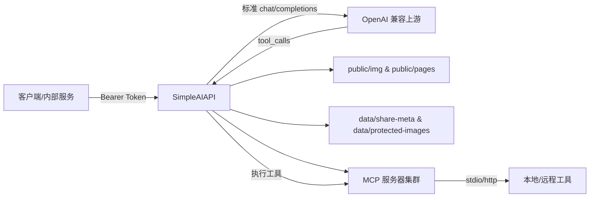

# SimpleAIAPI

> 🚀 基于 Express + TypeScript 的极简 OpenAI 兼容中转层，专注于“鉴权 + 消息标准化 + 富媒体渲染 + 分享页面”一条龙体验。

## 目录

1. [项目简介](#项目简介)
2. [架构概览](#架构概览)
3. [目录结构](#目录结构)
4. [快速开始](#快速开始)
5. [环境变量说明](#环境变量说明)
6. [API 使用说明](#api-使用说明)
7. [静态资源与分享页面](#静态资源与分享页面)
8. [日志与运维](#日志与运维)
9. [常见问题](#常见问题)

## 项目简介

SimpleAIAPI 让内部系统可以复用现有的 OpenAI 风格接口，而调用方只需提供一个 **`model/system/数字键`** 的扁平 JSON。项目同时支持文本、多张图片、LaTeX 渲染、托管页面分享与自动清理图片，是自建模型网关或多团队共用 API Key 的轻量化方案。

### 核心特性

- 🛡️ **入口鉴权**：验证标准 `Authorization: Bearer xxx` 请求头,可配置多枚入口 Token。
- 🔁 **多上游轮询**：`UPSTREAM_API_KEYS` 支持多 Key 轮询，减少单 Key 额度耗尽带来的中断。
- 📨 **消息扁平化**：自动把 `system` + 数字键消息转换成 OpenAI `chat/completions` 标准格式。
- 🖼️ **富媒体支持**：支持外链图片、Base64 图片写入 `/public/img`，并在转发时生成绝对地址。
- 🧮 **Markdown + LaTeX 渲染**：内置 markdown-it + KaTeX，可输出纯文本、HTML 片段或托管页面。
- 🔗 **一键分享**：`render=page` 自动生成分享页面、分享链接与提问记录，方便产品/运营查看。
- 🧹 **图片生命周期管理**：定期巡检 `public/img`，配合白名单避免分享中的图片被误删。
- 🔧 **MCP 工具集成**：完整支持 Model Context Protocol，可启动本地/远程 MCP 服务器，实现 AI 工具调用与多轮对话。
- 📊 **工具调用可视化**：在渲染页面中展示完整的工具调用过程，参数和结果支持折叠/展开。
- 🧾 **彩色 Emoji 日志**：自定义 Logger 输出，关键步骤全链路可追踪。

## 架构概览



1. 客户端 POST `/` 或 `/proxy`，附带授权头与扁平化消息。
2. 中转层解析请求、拉取/生成静态资源、调用上游模型。
3. 上游模型返回 `tool_calls` 时，网关自动执行 MCP 工具并继续多轮对话。
4. 根据 `render` 选项返回纯文本、HTML 或托管页面链接，相关图片落地到 `public/img`。
5. 后台定期清理过期图片，保证磁盘可控。

## 目录结构

```
.
├── src
│   ├── middleware        # request logger、鉴权中间件
│   ├── services          # payload 解析、消息构建、上游调用、渲染、分享等核心逻辑
│   ├── mcp               # MCP 客户端、管理器、工具转换等 MCP 相关逻辑
│   ├── utils             # 静态资源、URL、Katex、元数据、保护列表等工具
│   └── server.ts         # Express 入口
├── public
│   ├── img               # Base64 图片写入目录（挂载卷）
│   └── pages             # 生成的分享页面、字体等静态资源
├── data
│   ├── share-meta        # 分享页面元数据
│   └── protected-images.json
├── MCP.json              # MCP 服务器配置（需从 MCP.example.json 复制）
├── docker-compose.yml
├── .env.example
└── README.md
```

## 快速开始

### 环境依赖

- Node.js 18+（推荐 20 LTS）
- npm 10+
- Deno 2.x（仅当需要 `mcp-run-python` 等 Deno/uv 结合的工具；官方 Docker 镜像已预装，Alpine 环境推荐直接 `apk add deno` 以避免 `__res_init` 缺失等兼容性问题）
- Docker & Docker Compose（可选，用于一键部署）

### 本地运行

```bash
git clone <repo-url>
cd SimpleAIAPI
cp .env.example .env           # 根据需求调整配置
cp MCP.example.json MCP.json   # 准备 MCP 配置，可按需修改
npm install
npm run dev                   # 热重载开发模式

# 构建并运行生产版本
npm run build
npm start
```

### Docker Compose

```bash
cp .env.example .env
cp MCP.example.json MCP.json
docker compose up --build -d
```

`docker-compose.yml` 默认把 `./public/img` 以卷形式挂载，便于持久化分享图片。

## 环境变量说明

| 变量 | 默认值 | 说明 |
| --- | --- | --- |
| `PORT` | `8080` | HTTP 服务监听端口 |
| `AUTH_TOKENS` | `-` | 入口鉴权 Token，逗号分隔，必填 |
| `UPSTREAM_BASE_URL` | `https://api.openai.com/v1` | 兼容 OpenAI 的上游地址 |
| `UPSTREAM_API_KEYS` | `-` | 上游 API Key 列表，至少一枚，支持轮询 |
| `DEFAULT_MODEL` | `gpt-4o-mini` | 未指定 `model` 时的默认模型 |
| `TEMPERATURE` `MAX_TOKENS` `TOP_P` `FREQUENCY_PENALTY` `PRESENCE_PENALTY` | `undefined` | 全局默认参数，可选填 |
| `PUBLIC_BASE_URL` | 来自请求的 host | 对外拼接静态资源/分享链接时使用的根地址 |
| `REQUEST_TIMEOUT_MS` | `60000` | 上游接口超时时间 |
| `IMAGE_RETENTION_DAYS` | `7` | Base64 图片保留天数，设为 `0` 可关闭自动清理 |
| `IMAGE_CLEANUP_INTERVAL_MINUTES` | `60` | 清理任务的巡检频率（分钟） |
| `LOG_ASSISTANT_RESPONSES` | `false` | 设为 `true` 时日志会额外输出模型完整回答（注意脱敏） |
| `SANITIZE_HTML` | `true` | 控制 Markdown 渲染后是否做 HTML 清洗 |
| `TZ` | 系统默认 | 容器/进程时区，可在 Docker 中透传为 `Asia/Shanghai` |

> ✅ 建议复制 `.env.example` 后调整，避免遗漏必要字段。

## API 使用说明

### 端点列表

| 方法 | 路径 | 说明 | 认证 |
| --- | --- | --- | --- |
| `POST` | `/` | 核心转发接口 | 需要 `Authorization: Bearer <token>` |
| `POST` | `/proxy` | 功能同 `/`，便于兼容旧路径 | 同上 |
| `GET` | `/health` | 存活检查，返回 `status + timestamp` | 不需要 |
| `GET` | `/share/:shareId` | 读取托管页面 | 不需要（链接即权限） |

服务还会暴露静态目录：`/img/xxx`（图片）、`/pages/...`（HTML/字体）。

### 请求体示例

```json
{
  "model": "gpt-4o-mini",
  "system": "你是资深旅游顾问",
  "0": "请帮我规划 3 天北京行程，包含亲子活动",
  "1": "https://example.com/forbidden-city.jpg",
  "2": "data:image/png;base64,iVBORw0KGgoAAAANSUhEUgAA...",
  "render": "page",
  "tools": true
}
```

- `system`：可选的系统提示词。
- 数字键：按顺序代表用户消息，可是文本、图片 URL，也可传 Base64。
- 图片处理：Base64 自动写入 `public/img/<nanoid>.xxx`，外链会原样保留。
- `render` 取值：
  - 未传或 `false`：返回纯文本（`text/plain`）。
  - `true` / `"html"` / `"inline"`：返回渲染后的 HTML 片段（`text/html`），包含 Markdown + KaTeX。
  - `"page"` / `"hosted"` / `"url"`：生成托管页面，API 返回可直接分享的 URL。
- `tools`：是否启用 MCP 工具调用，默认为 `false`。设置为 `true` 时：
  - 网关会从 `MCP.json` 加载并启动所有配置的 MCP 服务器
  - 将可用工具转换为 OpenAI 标准格式注入到请求中
  - 自动处理上游返回的 `tool_calls`，执行对应的 MCP 工具
  - 支持多轮对话，直到模型不再请求工具调用为止
  - 最终返回时会包含完整的工具调用历史（参数、结果均支持折叠展开）

### 响应格式

| 渲染模式 | Content-Type | 响应内容 |
| --- | --- | --- |
| 纯文本 | `text/plain; charset=utf-8` | 模型原始回答（已合并 assistant 内容） |
| HTML 片段 | `text/html; charset=utf-8` | 加入 KaTeX 样式后的 HTML 字符串 |
| 托管页面 | `text/plain; charset=utf-8` | 预览页面 URL；分享链接可在页面中复制 |
| 错误 | `application/json` | `{ "error": "message" }` |

若开启 `LOG_ASSISTANT_RESPONSES=true`，日志会额外输出完整回答，便于排障。

## 静态资源与分享页面

- **Base64 图片写入**：位于 `public/img`，可通过 `PUBLIC_BASE_URL/img/<文件名>` 直接访问。
- **分享页面**：`render=page` 会生成两份 HTML：
  - 预览页（仅含回答）用于 API 返回的 URL。
  - 分享页（含提问记录）位于 `/share/:shareId`，会把图片标记为“保护状态”，避免被周期清理。
- **元数据持久化**：`data/share-meta/<shareId>.json` 保存页面与图片映射，`protected-images.json` 记录不应被清理的文件名。
- **自动清理**：`IMAGE_RETENTION_DAYS > 0` 时启动定时任务，按照 `IMAGE_CLEANUP_INTERVAL_MINUTES` 巡检；可通过将保留天数设为 `0` 来彻底关闭，并自行管理磁盘。

## MCP 工具配置

SimpleAIAPI 实现了完整的 **Model Context Protocol (MCP)** 客户端，可以启动和管理多个 MCP 服务器，支持本地 stdio 协议和远程 HTTP 协议。

### 配置文件

项目根目录的 `MCP.json` 文件用于配置 MCP 服务器，格式与 Claude Desktop / VS Code MCP 扩展兼容：

```json
{
  "version": "2025-01-01",
  "systemPrompt": "",
  "mcpServers": {
    "exa": {
      "command": "bunx",
      "args": ["-y", "mcp-remote", "https://mcp.exa.ai/mcp"]
    },
    "ddg-search": {
      "command": "uvx",
      "args": ["duckduckgo-mcp-server"]
    },
    "filesystem": {
      "command": "npx",
      "args": ["-y", "@modelcontextprotocol/server-filesystem", "/tmp"],
      "env": {
        "NODE_ENV": "production"
      }
    }
  }
}
```

### 配置项说明

- **`command`**: MCP 服务器的启动命令（如 `npx`、`uvx`、`bunx`、`python` 等）
- **`args`**: 命令行参数数组
- **`env`**: 可选的环境变量对象，会合并到进程环境中

### 支持的运行时

Docker 镜像已内置以下工具链：

- **Node.js**: `npx` / `node`（用于 npm 包管理的 MCP 服务器）
- **Python**: `uv` / `uvx`（用于 Python MCP 服务器）
- **Bun**: `bun` / `bunx`（用于高性能 JavaScript/TypeScript 工具）

### 工作流程

1. **服务启动时**：网关读取 `MCP.json`，并行启动所有配置的 MCP 服务器
2. **工具发现**：通过 MCP 协议的 `tools/list` 获取每个服务器提供的工具列表
3. **请求处理**：当客户端传入 `tools: true` 时：
   - 将所有可用工具转换为 OpenAI 标准格式（`function` 类型）
   - 注入到上游请求的 `tools` 字段
4. **工具执行**：上游模型返回 `tool_calls` 时：
   - 根据工具名称找到对应的 MCP 服务器
   - 通过 MCP 协议的 `tools/call` 执行工具
   - 将结果封装为 `tool` 角色的消息
5. **多轮对话**：继续将结果发送给上游，直到模型返回最终答案
6. **优雅关闭**：收到 `SIGTERM`/`SIGINT` 信号时，依次关闭所有 MCP 服务器

### 本地与远程 MCP

- **本地 stdio MCP**：直接启动子进程，通过标准输入输出通信（如 `@modelcontextprotocol/server-filesystem`）
- **远程 HTTP MCP**：通过 `mcp-remote` 等代理工具连接到远程 MCP 服务（如 Exa AI）
- 两种模式使用同一套配置格式，网关会自动处理通信细节

### 示例：常用 MCP 服务器

```json
{
  "mcpServers": {
    "filesystem": {
      "command": "npx",
      "args": ["-y", "@modelcontextprotocol/server-filesystem", "/workspace"]
    },
    "brave-search": {
      "command": "npx",
      "args": ["-y", "@modelcontextprotocol/server-brave-search"],
      "env": {
        "BRAVE_API_KEY": "你的_API_KEY"
      }
    },
    "exa": {
      "command": "bunx",
      "args": ["-y", "mcp-remote", "https://mcp.exa.ai/mcp"],
      "env": {
        "EXA_API_KEY": "你的_EXA_KEY"
      }
    },
    "ddg": {
      "command": "uvx",
      "args": ["duckduckgo-mcp-server"]
    }
  }
}
```

### Pyodide Python 沙盒（`mcp-run-python`）

[`mcp-run-python`](https://github.com/pydantic/mcp-run-python) 由 Pydantic 团队维护，底层通过 Deno + Pyodide 在 WebAssembly 沙盒中执行 Python 代码，既安全又无需担心依赖污染。要接入 SimpleAIAPI：

1. 安装 `uv`（项目 Docker 镜像已内置），并确保运行环境提供 [Deno](https://deno.com/) ≥ 2.x（自带镜像同样已预装，物理机部署时需手动安装）。
2. 在 `MCP.json` 中追加如下配置，默认使用 `stdio` 传输模式：

```json
{
  "mcpServers": {
    "mcp-run-python": {
      "command": "uvx",
      "args": ["mcp-run-python@latest", "stdio"],
      "description": "Pyodide 沙盒内执行任意 Python 代码，可自动安装依赖"
    }
  }
}
```

3. 需要额外安装 Python 第三方包时，可以在 `args` 中添加 `--deps pandas,numpy` 等参数，服务器会自动将依赖下载到隔离的 Deno 环境后再执行代码。

这样配置后，只要在请求体里把 `tools` 设为 `true`，上游模型即可调用 `mcp-run-python` 来执行分析脚本、生成临时数据或做快速验证，非常适合调试数学/数据处理逻辑。

### 首次使用

```bash
# 复制示例配置
cp MCP.example.json MCP.json

# 编辑配置，添加你需要的 MCP 服务器和 API Keys
vim MCP.json

# 启动服务（MCP 服务器会自动启动）
npm run dev  # 或 docker compose up
```

### 日志与调试

MCP 相关的日志会带有特定标识：

- `🔌 正在初始化MCP管理器...`：开始加载配置
- `🚀 正在启动MCP服务器`：启动单个服务器
- `✅ MCP服务器已就绪`：服务器启动成功，包含工具数量
- `🔧 调用MCP工具`：执行工具调用
- `🛑 正在关闭所有MCP服务器...`：优雅关闭

如果某个 MCP 服务器启动失败，网关会记录错误但继续启动其他服务器，不影响主服务运行。

### 注意事项

1. **API Keys**: 敏感的 API Key 建议通过环境变量注入，而不是直接写在 `MCP.json` 中
2. **Docker 环境**: `docker-compose.yml` 需要将 `MCP.json` 以只读方式挂载到容器
3. **禁用 MCP**: 如果不需要工具调用功能，可以：
   - 不创建 `MCP.json` 文件
   - 或在请求中不传 `tools: true`
4. **超时设置**: 某些 MCP 服务器（如远程搜索服务）可能需要较长的初始化时间（默认60秒超时）

## 日志与运维

- 日志级别：`info / warn / error / http / debug`，均带 Emoji + ISO 时间戳，便于快速定位。
- 入口鉴权失败、上游错误、图片清理、分享页面生成等关键事件都会输出详细上下文。
- `GET /health` 可配置在负载均衡/监控中，返回示例：`{ "status": "ok", "timestamp": 1732166400000 }`。
- 若部署在容器内，建议同时挂载 `public/` 与 `data/` 目录，防止 Pod 重启后无法访问旧图片。

## 常见问题

1. **如何支持多团队共享？**  
   将不同团队的 Token 写入 `AUTH_TOKENS`，结合 API Gateway 或 RTF 可区分限流。

2. **上游是自建模型怎么办？**  
   只要兼容 OpenAI `chat/completions` 即可，通过 `UPSTREAM_BASE_URL` + `UPSTREAM_API_KEYS` 指向对应服务。

3. **如何自定义托管页面样式？**  
   修改 `src/services/pagePublisher.ts` 的模板或 `public/pages` 下的 CSS（如 KaTeX 字体）。

4. **对外提供图片需要公网域名？**  
   建议配置 `PUBLIC_BASE_URL`，否则将 fallback 到实际请求的 host，可能在内网环境无法被上游回调访问。

喵～如果你在使用过程中有新的想法或想扩展某个功能，欢迎继续交流，一起把中转层打磨得更贴心！💡🐾
